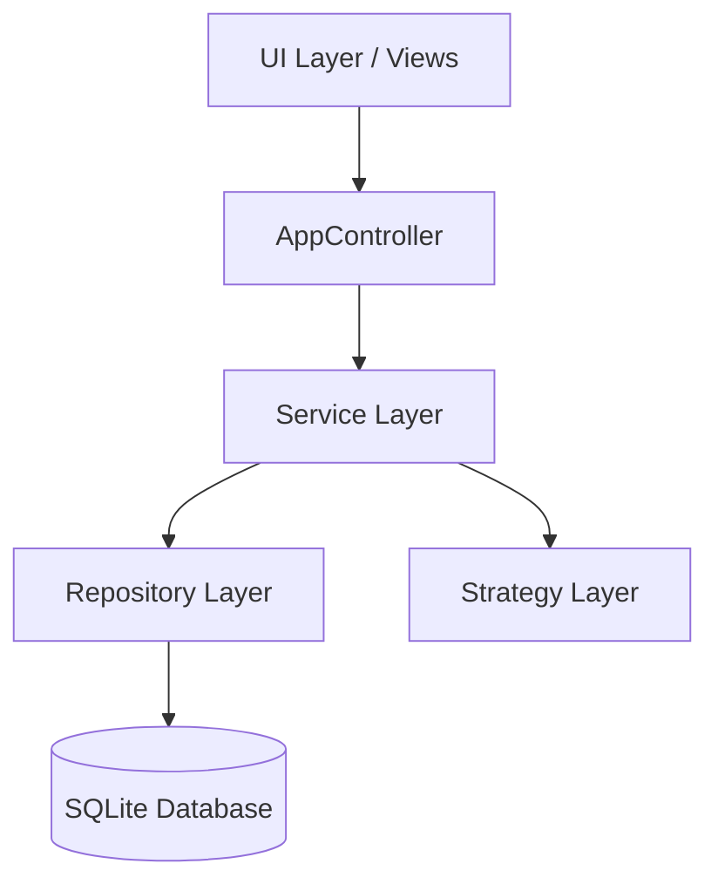

# DuplicateFinder Architecture

This document describes the SOLID-compliant architecture of the DuplicateFinder application, implemented during the Refactoring Phase (v2.0.0).

## Overview

The application follows Clean Architecture principles, separating concerns into distinct layers to improve maintainability, testability, and extensibility.

## Layers

### 1. Interfaces (Abstractions)
All major components are defined by interfaces in `src/interfaces/`. This enables Dependency Inversion Principle (DIP).
- `IView`: Standardizes UI interactions.
- `IFileRepository`: Abstract data access.
- `IFileService`, `IComparisonService`: Business logic contracts.

### 2. Domain (Value Objects)
Immutable data models used across the system, located in `src/domain/`.
- `FileInfo`: Encapsulates file metadata.
- `ComparisonOptions`: Encapsulates user-selected comparison settings.

### 3. Services (Business Logic)
Encapsulates high-level business logic in `src/services/`.
- `ProjectService`: Manages project lifecycle, settings persistence, and folder synchronization.
- `ComparisonService`: Coordinates comparison strategies across folders.
- `FileService`: Handles filesystem operations (move, delete, open folder) decoupled from the UI.

### 4. Repositories (Data Access)
Encapsulates database operations in `src/repositories/`.
- `SQLiteRepository`: Implements `IFileRepository` using the project's SQLite database.

### 5. Strategies (Algorithms)
Pluggable algorithms for metadata calculation and file comparison in `src/strategies/`.
- Extensible via `StrategyMetadata` and dynamic UI generation.

## Key Design Patterns

- **Repository Pattern**: Decouples logic from database schema.
- **Dependency Injection**: Services and repositories are injected into the controller, making it easily testable with mocks.
- **Strategy Pattern**: Allows easy addition of new comparison methods (Size, MD5, Histogram, LLM).
- **Service Layer**: Centralizes business logic that doesn't belong in either the UI or the Repository.
