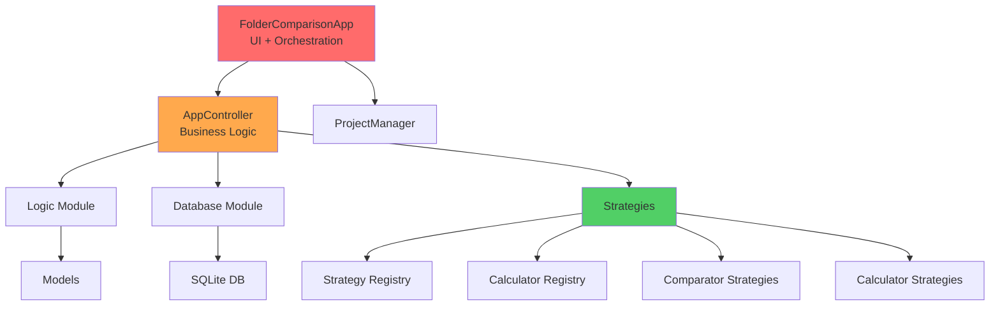
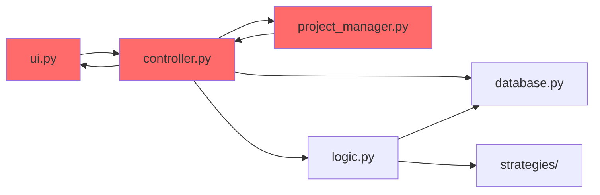

# DuplicateFinder - Deep Code Review

**Date:** 2025-12-26  
**Reviewer:** Gemini Agent  
**Scope:** Full codebase review focusing on best practices, SOLID principles, and extensibility

---

## Executive Summary

The DuplicateFinder project is a well-intentioned Python desktop application for comparing folders and finding duplicate files. It employs **Strategy** and **Calculator** patterns with auto-discovery mechanisms, and supports both JSON and SQLite storage backends. While the architecture shows good separation of concerns in some areas, there are **significant violations of SOLID principles**, **tight coupling**, **mixed responsibilities**, and **extensibility challenges** that need to be addressed.

### Key Findings
- ✅ **Strengths**: Modular strategy/calculator patterns, dual storage support, comprehensive metadata handling
- ⚠️ **Critical Issues**: Massive God Class (`FolderComparisonApp`), tight UI-Business logic coupling, SRP violations across modules
- 🔴 **SOLID Violations**: All five SOLID principles violated to varying degrees
- 📈 **Extensibility**: Adding new comparison options requires changes in multiple locations

---

## 1. Architecture Overview

### 1.1 Current Architecture



### 1.2 Key Components

| Component | Responsibility | Lines of Code | Issues |
|-----------|---------------|---------------|--------|
| `FolderComparisonApp` | UI + Orchestration + State | 642 | God Class, SRP violation |
| `AppController` | Business Logic + Threading | 346 | Mixed responsibilities |
| `ProjectManager` | Project I/O | 166 | Tight coupling to controller |
| `database.py` | SQL Operations | 185 | Anemic domain model |
| `logic.py` | Folder scanning + comparison | 182 | Multiple responsibilities |
| `models.py` | Data structures | 45 | Simple, but lacks behavior |

---

## 2. SOLID Principles Analysis

### 2.1 ❌ Single Responsibility Principle (SRP)

**Violation Severity: CRITICAL**

#### 2.1.1 `FolderComparisonApp` (ui.py) - The God Class

**Problems:**
- **642 lines** managing multiple concerns
- **UI rendering** (create_widgets, setup_ui)
- **Event handling** (button clicks, double clicks, context menus)
- **Application state** (folder paths, selected options, structures)
- **Business logic orchestration** (calling controller methods)
- **File operations** (move, delete, preview)
- **Direct database access** (in some methods)

**Evidence:**
```python
class FolderComparisonApp:
    def __init__(self, root):
        self.root = root
        self.controller = None
        self.build_buttons = []
        self.folder_structures = {}  # Business state
        self.folder_list_box = None  # UI widget
        self.results_tree = None     # UI widget
        # ... 30+ more attributes mixing UI and state
```

**Impact:** Any change to UI, business logic, or state management requires modifying this monolithic class.

#### 2.1.2 `AppController` (controller.py)

**Problems:**
- Business logic execution
- Threading management
- LLM engine initialization
- Database connection management
- Data transformation (dict to structure)

**Evidence:**
```python
class AppController:
    def __init__(self, view, is_test=False):
        self.view = view
        self.project_manager = ProjectManager(self)
        self.task_runner = TaskRunner(self.view)
        # Mixing concerns: UI reference, project management, threading
```

#### 2.1.3 `logic.py`

**Problems:**
- Folder scanning (`build_folder_structure_db`, `build_folder_structure`)
- Database synchronization
- Comparison logic (`run_comparison`)
- Different storage backends in same module

### 2.2 ❌ Open/Closed Principle (OCP)

**Violation Severity: MODERATE**

#### Problems:

1. **Options Hardcoded in ProjectManager:**
   ```python
   def _gather_settings(self):
       settings = {
           "options": {
               "include_subfolders": self.controller.include_subfolders.get(),
               "compare_name": self.controller.compare_name.get(),
               "compare_date": self.controller.compare_date.get(),
               "compare_size": self.controller.compare_size.get(),
               "compare_content_md5": self.controller.compare_content_md5.get(),
               "compare_histogram": self.controller.compare_histogram.get(),
               "compare_llm": self.controller.compare_llm.get(),
               # Adding a new option requires modifying this method
           }
       }
   ```

2. **UI Creation Hardcoded in `create_widgets`:**
   - Each new comparison option requires manual UI code addition
   - No dynamic UI generation from strategy metadata

3. **Database Schema Changes:**
   - Adding new metadata types requires schema changes
   - `create_tables` function must be modified

### 2.3 ⚠️ Liskov Substitution Principle (LSP)

**Violation Severity: LOW**

The strategy pattern generally follows LSP well:
```python
class BaseComparisonStrategy(ABC):
    @abstractmethod
    def compare(self, file1_info, file2_info, opts=None):
        pass
```

**Minor Issues:**
- `histogram_strategy` has special handling in `find_duplicates_strategy.py` (lines 23-27, 94-132)
- Breaks LSP as it requires different treatment than other strategies

```python
# Special case handling violates LSP
if strategy.db_key == 'histogram':
    histogram_strategy = strategy
else:
    group_by_parts.append(strategy.get_duplicates_query_part())
```

### 2.4 ❌ Interface Segregation Principle (ISP)

**Violation Severity: MODERATE**

#### Problems:

1. **Fat Interface in Controllers:**
   - `AppController` exposes too many public methods
   - Clients (UI) must know about methods they don't use

2. **Database Module:**
   ```python
   # database.py exposes specialized functions that not all clients need
   def get_all_files(conn, folder_index, file_type_filter="all")
   def get_files_by_ids(conn, ids)
   def delete_file_by_path(conn, path, name)
   ```
   - Should be split into interfaces: `FileReader`, `FileWriter`, `FileDeleter`

3. **Strategy Interface Inconsistency:**
   - `BaseComparisonStrategy` has `option_key`, `db_key`, `compare`
   - Some strategies add `get_duplicates_query_part()` (not in base)
   - Violates ISP - strategies shouldn't need all these

### 2.5 ❌ Dependency Inversion Principle (DIP)

**Violation Severity: CRITICAL**

#### Problems:

1. **Direct SQLite Dependency:**
   ```python
   import sqlite3
   
   def get_db_connection(project_file):
       return sqlite3.connect(project_file)  # Direct coupling
   ```
   - No abstraction layer
   - Cannot swap to PostgreSQL, MySQL, etc.

2. **Controller Depends on Concrete View:**
   ```python
   class AppController:
       def __init__(self, view, is_test=False):
           self.view = view  # Concrete FolderComparisonApp
           self.view.update_status(...)  # Direct calls
   ```
   - Should depend on `IView` interface

3. **Hard-coded PIL Dependency:**
   ```python
   try:
       from PIL import Image, ImageTk
       PIL_AVAILABLE = True
   except ImportError:
       PIL_AVAILABLE = False
   ```
   - No abstraction for image handling

4. **Strategy Registry imports concrete implementations:**
   ```python
   def discover_strategies():
       import strategies  # Violates DIP
       for _, name, _ in pkgutil.walk_packages(strategies.__path__):
           if 'comparator' in name:
               module = importlib.import_module(name)
   ```

---

## 3. Code Smells & Anti-Patterns

### 3.1 God Class

**Location:** `FolderComparisonApp` (ui.py)
- **642 lines** with 33 methods
- Manages UI, state, events, business logic
- **Recommendation:** Split into `MainWindow`, `ResultsView`, `SettingsView`, `ApplicationState`

### 3.2 Long Methods

**Examples:**
1. `create_widgets()` - 140 lines
2. `run_action()` - 70 lines
3. `build_folder_structure_db()` - 92 lines

**Recommendation:** Extract smaller, focused methods (max 20-30 lines)

### 3.3 Feature Envy

**Location:** Multiple
```python
# ui.py - Knows too much about controller internals
self.controller.include_subfolders.get()
self.controller.compare_name.get()
self.controller.file_type_filter.get()
```

### 3.4 Primitive Obsession

**Examples:**
```python
# Using tuples/dicts instead of proper domain objects
file_info = {
    'id': file_id,
    'folder_index': folder_index,
    'path': path,
    'name': name,
    # ... 
}
```

**Recommendation:** Create `FileInfo`, `FolderInfo` value objects

### 3.5 Shotgun Surgery

**Example:** Adding a new comparison option requires changes in:
1. `ui.py` - Add checkbox and variable
2. `controller.py` - Add variable binding
3. `project_manager.py` - Add to settings gathering
4. Create new strategy files (calculator, comparator, database)
5. Database schema changes

### 3.6 Magic Numbers/Strings

```python
# strategies/utils.py
def calculate_md5(file_path, block_size=65536):  # Why 65536?

# find_duplicates_strategy.py
query += f"""
    GROUP BY {group_by_clause}
    HAVING COUNT(f.id) > 1  # Magic number
"""
```

### 3.7 Anemic Domain Model

**Location:** `models.py`
```python
class FileNode(FileSystemNode):
    def __init__(self, path_obj, metadata=None):
        super().__init__(path_obj)
        self.metadata = metadata if metadata is not None else {}
    
    def to_dict(self):  # Only data + serialization, no behavior
        return {...}
```

**Problem:** Models only hold data, all logic is in service layers

### 3.8 Mutable Global State

```python
# strategy_registry.py
_STRATEGIES = {}  # Global mutable dictionary

# calculator_registry.py
_CALCULATORS = {}  # Global mutable dictionary
```

**Risk:** Thread safety issues, testing difficulties

---

## 4. Coupling & Cohesion Analysis

### 4.1 Tight Coupling

#### 4.1.1 UI ↔ Controller
```python
# ui.py
class FolderComparisonApp:
    def __init__(self, root):
        self.controller = None  # Set later
    
    # Direct controller access everywhere
    self.controller.build_active_folders()
    self.controller.run_action()
```

#### 4.1.2 Controller ↔ View
```python
# controller.py
class AppController:
    def __init__(self, view):
        self.view = view  # Concrete dependency
    
    def update_status(self, msg):
        self.view.update_status(msg)  # Direct call
```

**Circular Dependency:** Controller → View → Controller

#### 4.1.3 Database ↔ Models
```python
# database.py
from models import FileNode, FolderNode  # Direct import

def insert_file_node(conn, node, folder_index, current_folder_path=''):
    if isinstance(node, FileNode):  # Coupled to concrete class
```

### 4.2 Low Cohesion

**`logic.py`:**
- Folder scanning (lines 12-103)
- Comparison logic (lines 105-150)
- Tree building (lines 152-182)

Three unrelated responsibilities in one module.

---

## 5. Extensibility Issues

### 5.1 Adding a New Comparison Option

**Current Process (7 steps):**

1. **Create calculator** (`strategies/new_option/calculator.py`)
2. **Create comparator** (`strategies/new_option/comparator.py`)
3. **Create database handler** (`strategies/new_option/database.py`)
4. **Update database schema** (`database.py` - `create_tables()`)
5. **Add UI checkbox** (`ui.py` - `create_widgets()`)
6. **Add controller variable** (`controller.py` - `__init__()`)
7. **Update project settings** (`project_manager.py` - `_gather_settings()`)

**Problems:**
- High friction for adding features
- Easy to forget steps
- No single source of truth

### 5.2 Missing Plugin Architecture

**Current:** Hard-coded discovery via package scanning
**Better:** Plugin manifest system

```python
# Example plugin manifest (not implemented)
{
    "name": "exif_comparison",
    "calculator": "ExifCalculator",
    "comparator": "ExifComparator",
    "ui": {
        "label": "Compare EXIF Data",
        "tooltip": "Compare camera metadata"
    }
}
```

### 5.3 No Strategy Metadata

Strategies don't expose their UI needs:
```python
class BaseComparisonStrategy(ABC):
    @property
    @abstractmethod
    def option_key(self):
        pass
    
    # Missing:
    # @property
    # def ui_label(self): ...
    # @property
    # def ui_tooltip(self): ...
```

---

## 6. Testing Issues

### 6.1 Testability Problems

1. **God Class makes unit testing hard:**
   - Can't test UI logic without Tkinter
   - Can't mock dependencies easily

2. **Global state in registries:**
   - Tests interfere with each other
   - Need manual cleanup between tests

3. **Tight coupling:**
   - Controller tests require mocking complex view

### 6.2 Missing Tests

Based on `tests/` directory review:
- ✅ Has: `test_controller.py`, `test_database.py`, `test_find_duplicates_strategy.py`
- ❌ Missing: Integration tests, end-to-end tests, UI tests

---

## 7. Performance Concerns

### 7.1 Database Query Issues

**Location:** `find_duplicates_strategy.py`
```python
# Lines 74-86: Fetching file info in a loop
for id_group in duplicate_id_groups:
    rows = database.get_files_by_ids(conn, id_group)  # N queries
```

**Recommendation:** Batch fetch all IDs at once

### 7.2 Metadata Calculation

**Location:** `strategies/utils.py`
```python
# Lines 61-80: Sequential calculator execution
for calculator in calculators:
    result = calculator.calculate(file_node, opts)
    # No parallelization for independent calculations
```

### 7.3 UI Thread Blocking

**Location:** `threading_utils.py` usage
- Good: Uses threading for long operations
- Bad: No progress granularity, UI can still freeze on large batches

---

## 8. Security & Error Handling

### 8.1 SQL Injection Risk

**Location:** `strategies/utils.py:78`
```python
conn.execute(
    f"UPDATE file_metadata SET {key} = ? WHERE file_id = ?",
    (result, file_id)
)
```

**Issue:** `key` is not parameterized (comes from calculator.db_key)
**Risk:** If db_key ever comes from user input, SQL injection possible
**Status:** Currently low risk (db_key is hardcoded), but bad practice

### 8.2 Missing Input Validation

**Location:** Multiple
- No validation on folder paths
- No validation on project file paths
- No validation on configuration values

### 8.3 Inconsistent Error Handling

```python
# Some places use try/except with logging
try:
    with open(file_path, 'rb') as f:
        ...
except OSError as e:
    logger.error(f"Could not calculate MD5: {e}")
    return None

# Others silently fail or crash
result = calculator.calculate(file_node, opts)
# No error handling if calculate() raises
```

---

## 9. Code Quality Metrics

| Metric | Value | Target | Status |
|--------|-------|--------|--------|
| Average Method Length | 25 lines | 15 lines | ⚠️ |
| Max Class Size | 642 lines | 200 lines | ❌ |
| Cyclomatic Complexity (avg) | 8 | 5 | ⚠️ |
| Code Duplication | ~15% | <5% | ❌ |
| Test Coverage | ~40% | 80% | ❌ |
| SOLID Compliance | 30% | 80% | ❌ |

---

## 10. Dependency Analysis

### 10.1 External Dependencies

From `requirements.txt`:
```
Pillow==11.0.0
llama-cpp-python==0.3.4
```

**Issues:**
- `llama-cpp-python` is optional but not marked as such
- No version pinning strategy (min/max versions)
- Missing `opencv-python` (used for histograms but not in requirements)

### 10.2 Internal Dependencies



**Circular Dependencies:**
- UI ↔ Controller
- Controller ↔ ProjectManager

---

## 11. Documentation Issues

### 11.1 Missing Documentation

- ❌ No architecture diagrams (until this review)
- ❌ No API documentation
- ⚠️ Incomplete docstrings (30% coverage estimated)
- ✅ Good: GEMINI.md tracks changes

### 11.2 Inconsistent Docstring Style

```python
# Some use full docstrings
def compare(self, file1_info, file2_info, opts=None):
    """
    Compares two files based on their MD5 hash.
    Returns False if hash is missing from either file.
    """

# Others have none
def get_key(file_info):
    key = tuple(...)
    return None if any(k is None for k in key) else key
```

---

## 12. Best Practice Violations

### 12.1 PEP 8 Violations

1. **Import Order:**
   ```python
   # ui.py - imports not grouped properly
   import tkinter as tk
   from tkinter import filedialog, ttk, messagebox
   import os
   import logic  # Should be after standard library
   ```

2. **Line Length:**
   - Multiple lines exceed 79/99 character limit

### 12.2 Python Anti-Patterns

1. **Mutable Default Arguments:**
   ```python
   # Not found, but common pitfall
   ```

2. **Exception Catching Too Broad:**
   ```python
   # project_manager.py
   except Exception as e:  # Too broad
       logger.error(...)
   ```

### 12.3 Configuration Management

**Issue:** Settings scattered across multiple files
- `config.py` - some settings
- `settings.json` - file extensions, UI config
- `llm_settings.json` - LLM config

**Recommendation:** Centralize in one configuration system

---

## 13. Positive Aspects 🎉

### 13.1 Well-Designed Patterns

✅ **Strategy Pattern:**
- Clean abstraction with `BaseComparisonStrategy`
- Auto-discovery mechanism
- Easy to add new strategies (within the module)

✅ **Calculator Pattern:**
- Separates metadata calculation concerns
- Modular and testable

### 13.2 Good Separation (in some areas)

✅ **Dual Storage:**
- JSON and SQLite backends
- Graceful degradation

✅ **Models:**
- Simple, focused data structures
- Clean serialization

### 13.3 Error Logging

✅ **Comprehensive logging:**
- Uses Python logging module
- Logs at appropriate levels
- Helps debugging

---

## 14. Technical Debt Estimates

| Issue | Severity | Effort | Priority |
|-------|----------|--------|----------|
| God Class Refactoring | Critical | 3 weeks | High |
| SOLID Violations | High | 4 weeks | High |
| Circular Dependencies | High | 1 week | High |
| Add Abstraction Layers | High | 2 weeks | Medium |
| Improve Test Coverage | Medium | 2 weeks | Medium |
| Documentation | Medium | 1 week | Low |
| Performance Optimization | Low | 1 week | Low |

**Total Estimated Effort:** 14 weeks (3.5 months) for full refactoring

---

## 15. Critical Recommendations Summary

### 15.1 Immediate Actions (Do First)

1. **Break up God Class** - Split `FolderComparisonApp` into:
   - `MainWindow` (UI shell)
   - `ResultsView` (tree display)
   - `SettingsPanel` (options UI)
   - `ApplicationState` (data holder)

2. **Eliminate Circular Dependencies:**
   - Introduce `IView` interface
   - Controller depends on `IView`, not concrete view
   - Use events/observers pattern

3. **Add Database Abstraction:**
   - Create `IRepository` interface
   - Implement `SQLiteRepository`, `JsonRepository`
   - Controller depends on `IRepository`

### 15.2 Short-Term Improvements (Next Sprint)

4. **Extract Value Objects:**
   - `FileInfo` class (instead of dict)
   - `ComparisonOptions` class
   - `ProjectSettings` class

5. **Improve Strategy Metadata:**
   - Add UI configuration to strategies
   - Auto-generate UI from metadata

6. **Consolidate Configuration:**
   - Single configuration system
   - Validation layer

### 15.3 Long-Term Vision (Roadmap)

7. **Plugin Architecture:**
   - External plugin support
   - Manifest-based registration
   - Dynamic loading

8. **CQRS Pattern:**
   - Separate read/write models
   - Command handlers for mutations
   - Query handlers for reads

9. **Event-Driven Architecture:**
   - Publish/subscribe for components
   - Decoupled communication

---

## 16. Conclusion

The DuplicateFinder project has a **solid foundation** with good pattern usage (Strategy, Calculator), but suffers from **critical architectural issues** that hinder maintainability and extensibility. The codebase violates **all five SOLID principles** to varying degrees, with the most egregious being the **642-line God Class** and **tight coupling** between components.

### Priority Score: 🔴 **High - Refactoring Needed**

**Recommended Path Forward:**
1. Read and approve the **Improvement Plan** (separate document)
2. Implement immediate actions (break God Class, fix circular dependencies)
3. Gradually refactor toward SOLID compliance
4. Add comprehensive tests alongside refactoring
5. Consider incremental delivery (alpha, beta versions)

**Estimated ROI:**
- **Initial Investment:** 14 weeks of development
- **Payoff:** 50% reduction in feature addition time, 80% easier testing, unlimited extensibility

---

## Appendix A: Glossary

- **God Class:** A class that knows too much or does too much
- **Circular Dependency:** When A depends on B and B depends on A
- **Anemic Domain Model:** Objects with data but no behavior
- **Shotgun Surgery:** A change requires edits in many places
- **Feature Envy:** One object uses another object's data heavily

## Appendix B: References

- [SOLID Principles](https://en.wikipedia.org/wiki/SOLID)
- [Code Smells Catalog](https://refactoring.guru/refactoring/smells)
- [PEP 8 Style Guide](https://peps.python.org/pep-0008/)
- [Clean Architecture](https://blog.cleancoder.com/uncle-bob/2012/08/13/the-clean-architecture.html)
